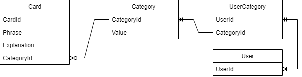
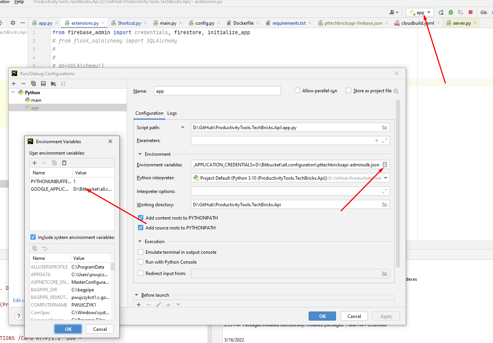

# ProductivityTools.TechBricks.Api




## Configuration
For local run I have Environment Variable set which points out to the ServiceAccont json file


For GCP I setup the ``GOOGLE_CLOUD_PROJECT`` environment variable in the ``cloudbuild.yaml`` file
GCP is on it is own make an validation with this setup
```
- name: google/cloud-sdk
  args: [ 'gcloud', 'run', 'deploy', 'techbricksapi',
          '--image=us-central1-docker.pkg.dev/${PROJECT_ID}/apiimage/image:${SHORT_SHA}',
          '--region', 'us-central1', '--platform', 'managed',
          '--allow-unauthenticated' ,'--update-env-vars', 'GOOGLE_CLOUD_PROJECT=${PROJECT_ID}']
```

```
Invoke-WebRequest -Uri http://127.0.0.1:8080/Card -Method Post -Body (@{name='VS';owners=@('pwujczyk@gmail.com','gopara@gmail.com');data=@(@{shortcut="zrt1";explanation="fda"},@{shortcut="zrt2";explanation="fda"})}|ConvertTo-Json) -ContentType application/json
```

in requrements maybe firestore shuld be added

API which needs to be enabled
- Cloud Run API
- Artifact Repository API

## Debugger

In .vscode directory launch.json file exists. In this file the reference to the .env file is defined

```
"envFile": "d:/GitHub/Home.Configuration/ProductivityTools.TechBricks.Prod.env",
```
In this file the environment variable that points to the an admin-sdk is defined
```
GOOGLE_APPLICATION_CREDENTIALS="d:\GitHub\Home.Configuration\pttechbricksprod-firebase-adminsdk-l92xc-b75638fd8f.json"
GOOGLE_CLOUD_PROJECT="pttechbricksprod"
```
